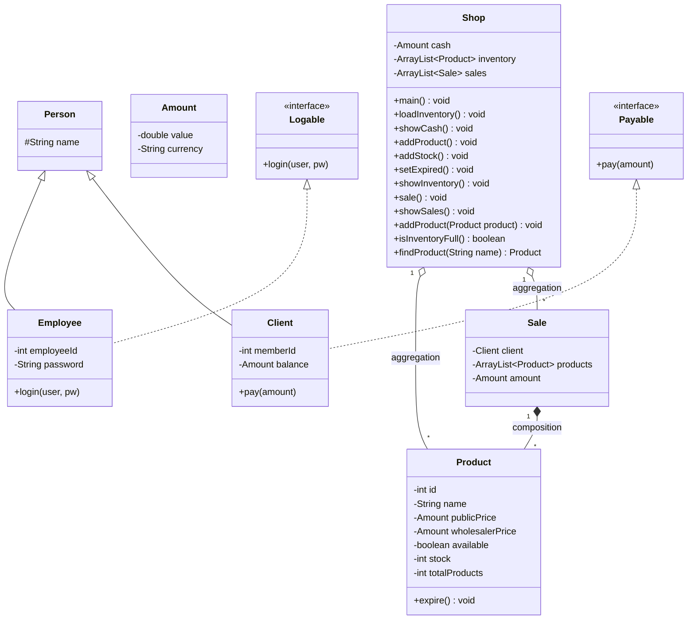

# 🏪 Shop Application – Programación Orientada a Objetos (RA4 → RA7)

## 📌 Descripción del proyecto

Este proyecto corresponde a una **aplicación de gestión de tienda desarrollada en Java**, utilizada como práctica académica en el **Grado Superior de Desarrollo de Aplicaciones Web (DAW)** en **Stucom**.

La aplicación fue desarrollada inicialmente en el **RA4 (Programación Orientada a Objetos)** y posteriormente **reutilizada, ampliada y mejorada en el RA7**, incorporando nuevos requisitos funcionales y técnicos que permiten una gestión más realista de una tienda.

El proyecto pone especial énfasis en el uso correcto de **POO**, **interfaces**, **herencia**, **clases abstractas**, **colecciones dinámicas (ArrayList)** y **relaciones entre clases**.

---

## 🎯 Objetivos académicos

* Aplicar los principios de la **Programación Orientada a Objetos**
* Reutilizar y evolucionar un proyecto existente (RA4 → RA7)
* Eliminar limitaciones estructurales del sistema
* Implementar **roles de usuario**, **login**, **pagos** y **gestión avanzada**
* Modelar correctamente las relaciones entre clases mediante UML

---

## ⚙️ Requisitos

* **Java JDK 17**
* IDE compatible (IntelliJ IDEA, Eclipse, VS Code, NetBeans…)

---

## 🚀 Funcionalidades principales

### Funciones base (RA4)

1. Mostrar caja de la tienda
2. Añadir productos al inventario
3. Añadir stock a productos
4. Marcar productos como caducados
5. Mostrar inventario
6. Realizar ventas
7. Mostrar ventas realizadas

### Mejoras implementadas en RA7

* Eliminación de límites en inventario, ventas y productos por venta
* Eliminación de productos del inventario
* Login obligatorio de empleado
* Introducción de roles (Empleado y Cliente)
* Sistema de pago con saldo del cliente
* Gestión de deuda si el saldo es insuficiente
* Uso de **interfaces** y **clases abstractas**
* Relaciones UML: agregación, composición, herencia e implementación

---

## 🧩 Estructura del proyecto

### Clases principales

* **Shop**: gestiona el inventario, las ventas y el flujo de la aplicación
* **Product**: representa los productos de la tienda
* **Sale**: representa una venta realizada
* **Amount**: encapsula importes y moneda

### Roles y abstracciones

* **Person (abstract)**: clase base para personas del sistema
* **Employee**: empleado que accede a la aplicación
* **Client**: cliente que realiza compras

### Interfaces

* **Logable**: define el comportamiento de login
* **Payable**: define el comportamiento de pago

---

## 🗂️ Diagrama de clases (RA7)



---

## 📥 Instalación

```bash
git clone https://github.com/Stucom-Pelai/MP0485_RA4_POO_Shop
```

---

## ▶️ Ejecución

Ejecutar la clase principal:

```bash
main.Shop.java
```

---

## 🔐 Credenciales de prueba (RA7)

**Empleado**

* Número de empleado: `123`
* Nombre: `test`
* Contraseña: `test`

**Cliente**

* Número de socio: `456`
* Saldo inicial: `50.00 €`

---

## 🧪 Pruebas realizadas

* Inventario sin límite de productos
* Ventas sin límite
* Ventas con más de 10 productos
* Eliminación correcta de productos
* Login válido e inválido de empleado
* Pago con saldo suficiente
* Pago con saldo insuficiente mostrando deuda

---

## 🎓 Contexto académico

* **Ciclo:** Grado Superior de Desarrollo de Aplicaciones Web (DAW)
* **Centro:** Stucom
* **Módulo:** MP0485 – Programación
* **Resultados de aprendizaje:** RA4 y RA7

---

## ✍️ Autor

Proyecto desarrollado por **Ignacio**, como parte de las prácticas académicas del módulo de Programación.

---

Si quieres, en el siguiente paso puedo:

* Ajustarlo exactamente al **enunciado RA7**
* Añadir una **conclusión/reflexión técnica**
* Simplificar el README para entrega
* Prepararte una **explicación oral del diagrama** para defensa en clase
